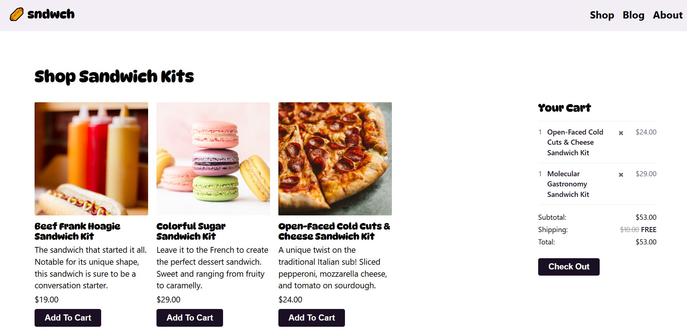

# Astro_Food_Website  
This was my first experience using Astro to create a website. It also includes React and SolidJS integration for some components. The project is a fully-featured web app with a marketing homepage, an e-commerce store, a blog with an RSS feed, and a newsletter sign-up form, all developed in Astro.js.  

## Acknowledgements  
- [Workshop Repo](https://github.com/learnwithjason/astro-frontend-masters)  

## Challenges and Lessons Learned  

- **Learning Astro**: I explored the fundamentals of Astro.js and learned how to integrate other framework components into it. This included understanding API handling, dynamic routing, form submissions, and developing server-rendered pages.  

- **NanoStores for Cross-Framework State Sharing**: We used NanoStores for sharing state across different framework components. In the screenshot, you can see the Cart on the right, which is built in SolidJS, while the items on the left are written in React. Both share state seamlessly using NanoStores.  

## [Demo Video](./demo.mp4)
